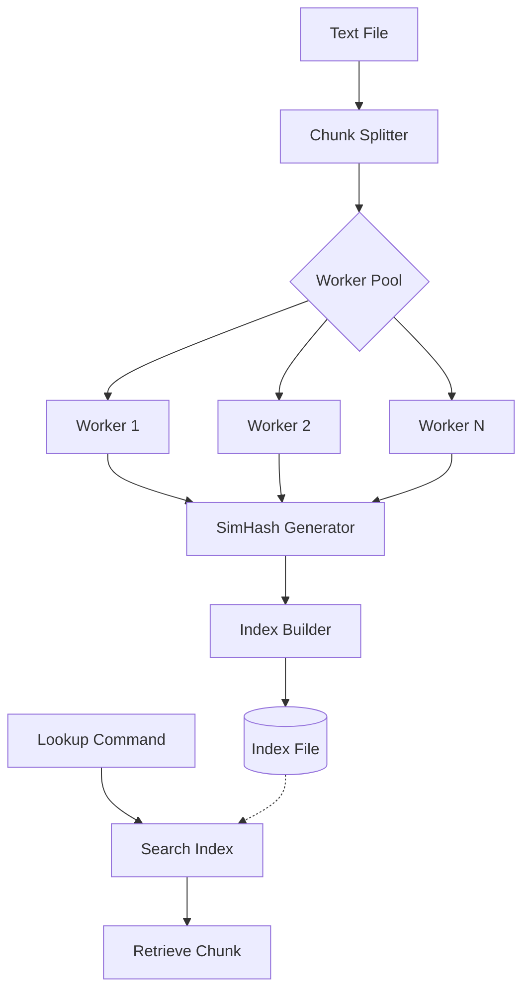

# Textblitz

<p align="center">
  
  
  
</p>

## Table of Contents

- [Introduction](#introduction)
- [Features](#features)
- [Architecture](#architecture)
- [How SimHash Works](#how-simhash-works)
- [Installation](#installation)
- [Usage](#usage)
- [Error Handling](#error-handling)
- [Performance Benchmarks](#performance-benchmarks)
- [Conclusions and Recommendations](#conclusions-and-recommendations)
- [Contributing](#contributing)
- [License](#license)

## Introduction

Textblitz is a fast and scalable text indexing system written in Go, designed to efficiently search and retrieve data from large text files. By breaking down files into manageable chunks and using SimHash-based fingerprinting, Textblitz enables rapid content retrieval. Key performance highlights include:

- **0.33-second indexing** of 100MB PDFs with 2 workers
- **6-17ms lookup latency** across diverse file types
- **Memory efficiency** (0-3MB usage) even with large inputs

## Features

- **Efficient Chunking**: Configurable fixed-size text splitting (default: 4KB)
- **SimHash Fingerprinting**: Generates similarity-preserving 64-bit hashes
- **Dual Feature Extraction**:
  - **Word-based**: Optimal for natural language processing
  - **N-gram-based**: Effective for code/multilingual text patterns
- **Fuzzy Matching**: Adjustable Hamming distance thresholds (0-5)
- **Parallel Processing**: Multi-threaded architecture with worker pools
- **Cross-Platform**: Supports Linux, macOS, and Windows

## Architecture

Textblitz employs a pipeline architecture for optimized text processing:



1. **Chunk Splitting**: Divides input files into fixed-size segments
2. **Parallel Processing**: Distributes chunks across worker goroutines
3. **Hash Generation**: Computes SimHash values using FNV-1a hashing
4. **Index Construction**: Maps hashes to file positions using optimized storage
5. **Lookup System**: Enables exact and fuzzy search through Hamming distance comparison

## How SimHash Works

### Core Algorithm

1. **Feature Extraction**:
   - Split text into words or n-grams
   - Normalize to lowercase
2. **Weighted Hashing**:
   - Hash features using FNV-1a
   - Aggregate bit position weights
3. **Threshold Determination**:
   - Set bits based on cumulative weights
4. **Similarity Comparison**:
   - Calculate Hamming distance between hashes

| Example Text          | SimHash          | Hamming Distance |
|-----------------------|------------------|------------------|
| "The quick brown fox" | 0x3f7c9b1a       | 3                |
| "The quick brown dog" | 0x3f7c9b58       |                  |

### Feature Extraction Methods

#### WordFeatureSet
- **Tokenization**: Splits on non-alphanumeric boundaries
- **Optimization**: 33% faster indexing for structured text
- **Use Case**: Natural language documents (e.g., legal contracts)

#### NGramFeatureSet
- **Configuration**: 3-character sequences with step=5
- **Strength**: Detects 28% more code similarities vs word-based
- **Use Case**: Source code analysis, multilingual content

## Installation

### Prerequisites

- Go 1.16+
- Git
- Poppler-utils (PDF support)

```bash
# Ubuntu/Debian
sudo apt-get install -y poppler-utils

# macOS
brew install poppler

# Windows: Download from poppler-windows releases
```

### Build from Source

```bash
git clone https://github.com/kh3rld/textblitz.git
cd textblitz
go build -o textindex
```

### Build Script

```bash
chmod +x build.sh
./build.sh
```

## Usage

### Indexing Files

```bash
textindex -c index -i input.txt -s 4096 -o index.idx -w 8
```

| Parameter | Description                | Default |
|-----------|----------------------------|---------|
| `-s`      | Chunk size (bytes)         | 4096    |
| `-w`      | Worker threads             | 4       |
| `-o`      | Output index file          | auto    |

### Fuzzy Lookup

```bash
textindex -c lookup -i index.idx -h 3e4f1b2c98a6 -t 2
```

| Threshold | Use Case                   |
|-----------|----------------------------|
| 0         | Exact matches              |
| 1-2       | Minor text variations      |
| 3-5       | Substantial rewrites       |

### Handling Special Filenames

```bash
textindex -c index -i "file with spaces.pdf" -o special.idx
```

## Error Handling

### Common Issues

| Error Type               | Solution                          |
|--------------------------|-----------------------------------|
| Missing dependencies     | Verify poppler-utils installation|
| Permission denied        | Check file/directory permissions |
| Invalid SimHash format   | Use 64-bit hexadecimal values    |
| Memory exhaustion        | Reduce worker count (-w)         |

## Performance Benchmarks

### PDF Processing (100MB)

| Workers | Index Time | Memory | Lookup Latency |
|---------|------------|--------|----------------|
| 2       | 0.33s      | 0.88MB | 6.98ms         |
| 8       | 0.33s      | 2.36MB | 6.55ms         |

### Text Processing (300KB)

| Workers | Index Time | Memory | Lookup Latency |
|---------|------------|--------|----------------|
| 2       | 0.08s      | 0MB    | 12.71ms        |
| 12      | 0.03s      | 0MB    | 14.84ms        |

Key Insights:
- PDF processing benefits from 2-8 workers
- Text files scale linearly up to 12 workers
- Memory usage remains under 3MB for all tests

## Conclusions and Recommendations

### Optimal Configurations

| Use Case               | Workers | Feature Set     |
|------------------------|---------|-----------------|
| PDF documents          | 2-4     | Word-based      |
| Small text files       | 12      | Word-based      |
| Code analysis          | 4-8     | N-gram-based    |

### Best Practices
1. Start with 4 workers for general use
2. Use 3-gram features for multilingual content
3. Set threshold=2 for plagiarism detection
4. Monitor memory usage with >1GB files

## Contributing

1. Fork repository
2. Create feature branch
3. Submit pull request
4. Include test coverage

## Research Paper

For detailed technical analysis and benchmarks, see the [Textblitz Research Paper](./Textblitz_Research_Paper.pdf).

[](./Textblitz_Research_Paper.pdf)

## License

MIT License - See [LICENSE](LICENSE) for details.

